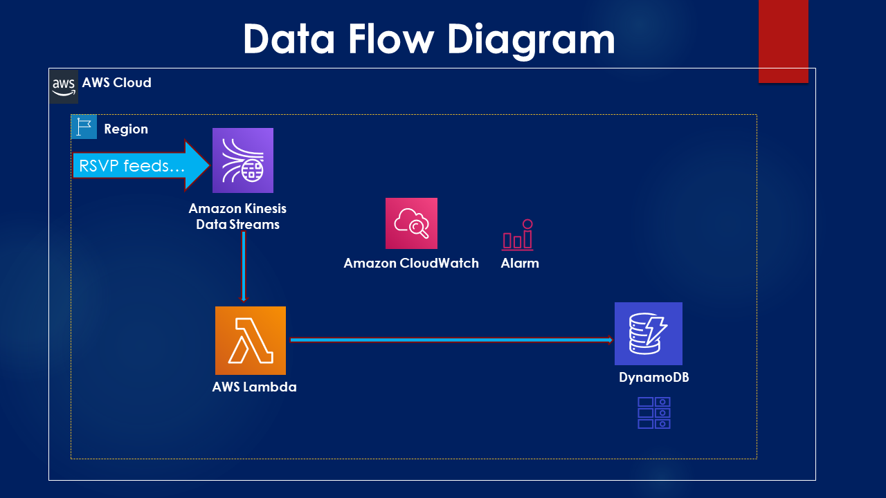

## Data Pipeline design for Accommodation Consolidator.

## Table of contents
* [General info](#general-info)
* [Technologies & AWS Services](#technologies)
* [Flow-Diagram](#flow-diagram)

## General info
Accommodation Consolidator project is designed to process and consolidate the partners catalog data using multiple AWS resources. The 
input raw data is going to be S3 bucket and after consolidation the output destination is also S3 bucket.
This documents take you through the complete data pipeline desing i.e. reading from s3, processing components & final storage.

## Technologies & AWS Services
* Python3.X
* Terraform for IAC (Infrastructure as Code)
* Jenkins for Automation of Infra and Code Deployment
* AWS Resources:
  * S3 Bucket
  * SQS
  * AWS DynamoDB
  * AWS Lambda
  * AWS CloudWatch
  * AWS IAM  

## Flow-Diagram
